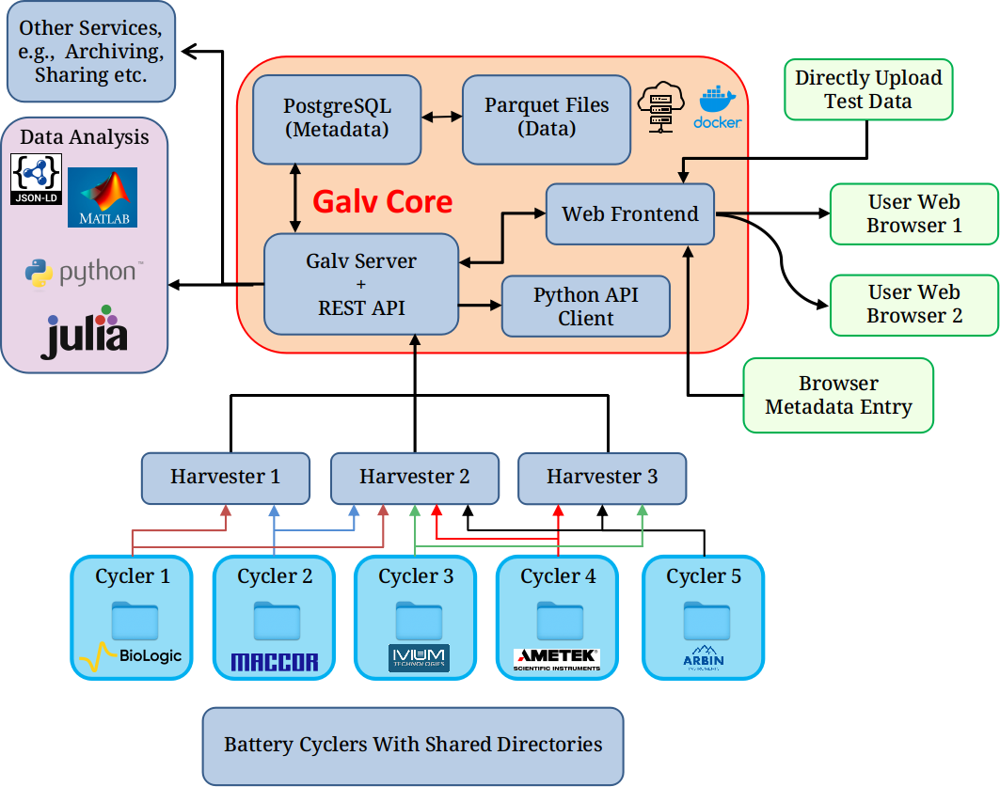
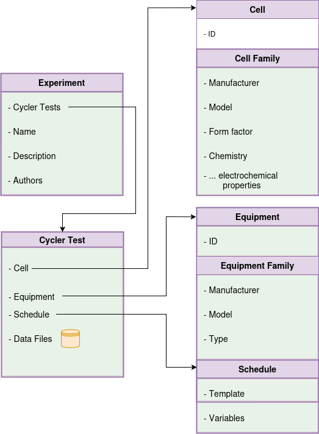

# Summary

The `Galv` project is a data and metadata management platform for battery science. Labs conducting battery research can use the platform to store and share (meta)data created from experimental electrochemical experiments. This data includes information about the electrochemical cell, the experiments, and the results. The platform provides a REST API for programmatic access to the data and metadata, in addition to a web interface for user interaction. The web interface provides tailored code for using the REST API in Python, Julia, and MatLab. This enables users to curate the experimental data within a single platform before completing advanced data analysis in their preferred language. The platform is designed to be extensible, allowing users to define their own metadata schemas and data types. This platform can be self-hosted or used as a cloud service enabling wider collaborations and sharing of experimental test data.

# Statement of need

`Galv` is designed to address the need for a centralised data and metadata management platform for battery science.
Battery research is a rapidly growing field, with many labs conducting experiments and generating data. This data is often stored in a variety of formats, making it difficult to share and compare results. By providing a centralised platform for storing and sharing data and metadata, `Galv` aims to make it easier for researchers to collaborate and build on each other's work. Futhermore, by defining a minimal structure for data, `Galv` can help researchers to ensure that their data is interoperable for meta-analysis and data science purposes.

# Architecture

The `Galv` platform is composed of three key components, the `backend`, the `frontend`, and the `harvester`. The `backend` stores the corresponding (meta)data in parquet containers with a REST API that provides programmatic access for the frontend as well as third-party applications. The `frontend` is a web interface that allows users to interact, modify, and export the (meta)data stored in the platform. Finally, the `harvester` is a python package that can be used to automatically collect data and metadata from experiments and store it in the platform. The interaction of these three components is shown in \autoref{fig:architecture} below.

{width=80%}

Galv is deployed as individual components with Docker images. These images can be built from the current state of development, or through images built during a Galv release and hosted on GitHub's container registry.

## The `backend` server

The Galv backend is implemented with the Django framework [@django], with a corresponding REST API.
This backend provide storage, authentication, and account management for the platform.
Metadata are stored directly in the Postgres database, while experimental data are stored separately in parquet format.
Experimental data can be stored directly on the Galv server, or in AWS S3.

The backend is available as a docker image, which allows Galv to be run locally with minimal configuration.
Configuring the images for cloud deployment is straightfoward and documented.
Once set up, the backend is designed to require minimal maintenance.

## The `frontend` interface

The web-based frontend is implemented with the React framework and interfaces with the backend via the REST API.
The frontend is the direct access for users' to the platform and is designed to provide the majority of the metadata curation.
The frontend is structured to give end-users account management, split into individual user level, team-based, and laboratory.
Each of these levels provides a structure tier for safe management of the underlying experimental data.
The aim is to provide a structure that aligns with standard laboratory permissions and organisation.

The underlying data files from experiments are the foundation, but Galv encourages associating them with other resources.
Metadata about the specific cells tested, machines used, and schedule followed can all be associated with data files.
Cells and machines are grouped by their make and model, and differentiated by unique ids (e.g. a serial number), making it easy to know both what kind of cell was tested and which specific cell was tested.
Schedules include support for the overall structure of the cycler schedule as well as variations within that structure.
Data files can be grouped together into Cycler Tests, which can in turn be packaged together as Experiments.
Further arbitrary metadata can also be associated with data files or any other resources, so a Cell might include X-ray images or a data file a note about a machine failure.

Data files are easily recognised because they are accompanied by the time-series graph of their voltage and current.
Data files can be uploaded directly, and users can choose a method for parsing them.
New parsing methods can be defined using a tool that shows before and after views of the incoming data.
Python, Matlab, and Julia code is generated automatically for downloading any number of data files selected by the user.

Items to discuss:
- ~Metadata entry and organisation~
- ~Time-series data rendering, application of CSV importing w/ header application (and storage for future events)~
- ~Attachement of additional metadata in general object format to the underlying data (Image based datasheets, X-ray imaging, etc.)~

## The `Harvester` package

The harvester package is deployed through PyPI and provides the link between the experimental data acquisition within the laboratory and the Galv platform.
Where possible, the harvesters parse the data files generated by the electrochemical cyclers and provide the backend a parquet converted container for storage.
Currently, the supported proprietary data files include: Biologic, Maccor, and Ivium; however, data files stored in CSV format are parsed with the user providing mapping of the headers to the exportable object vectors in the frontend.
Multiple harvesters can be setup on a single machine, with each monitoring a specified directory, optionally with a regular expression to filter included files.
Each harvester is provided an API key on creation to communicate with the Galv backend.

The harvester package also includes a user-friendly setup wizard accessible via the command-line interface, making deployment and configuration straightforward.
Once set up, harvesters can be managed in the front end, so require very little maintenance.

Items to discuss:
- Harvester options
- The ability to regex the directory
- Galvani repository reference

# Key functionality

## a. Data management

Galv provides a robust and flexible data management system designed to facilitate the organization and storage of experimental data related to battery research. It uses the Parquet format to store data, which ensures fast and efficient data access. Additionally, PostgreSQL is used for managing metadata, enabling quick retrieval and organization of experimental details. The platform supports flexible and extensible metadata schemas that users can define based on their specific research needs, allowing them to tag and retrieve data efficiently. Users can upload, view, and download datasets seamlessly through the web interface or programmatically via the REST API, ensuring accessibility for various workflows. Galv support data import and export in different widely-used data science languages like Python, Julia, and MatLab, ensuring smooth data transfer and processing across different platforms.
Integrated tools support the conversion of proprietary battery data formats (e.g., Biologic, Maccor, Ivium) into a unified structure. This process significantly improves workflow efficiency by eliminating the need for manual reformatting and enhances accuracy in downstream analysis by standardizing the input data.

## b. Access control

Galv implements a tiered access control system to ensure secure and organized management of data. Access is managed at multiple levels. Individual users have private accounts for user-specific data, while teams benefit from collaborative groups with shared permissions for specific projects or experiments. Lab functions as higher-level entities for overarching management of multiple teams and projects. Administrators can assign roles, manage permissions, and oversee data access within their domain, ensuring compliance with institutional guidelines and fostering collaboration while maintaining data security.

## c. Validation schemas

Validation schemas serve as powerful tools for ensuring the integrity and consistency of data within files and validating the metadata associated with other resources in the Galv ecosystem. These validation schemas are defined using the JSON Schema specification, a widely adopted standard for describing and validating JSON data structures. This flexible format enables the creation of schemas capable of validating any JSON data, regardless of its complexity or structure. By default, Galv applies a loose validation schema to all data, ensuring adherence to the fundamental requirement of being valid JSON. Additionally, this default schema checks for the presence of the minimal required columns: "time", "potential difference", and "current" – essential columns for most battery cycling experiments and analyses. However, users have the flexibility to define and apply more stringent validation schemas tailored to their specific needs. These custom schemas can enforce additional constraints, such as data types, value ranges, and complex relationships between different fields.

## d. Automatic unsupervised data harvesting

Galv features an automatic unsupervised data harvesting system that collects data directly from experimental setups without requiring manual intervention. Using the Harvester package, the platform can automatically collect data files from specified directories on the machine where the data is being generated. Harvesters monitor directories for new data files, process them, and upload them to the Galv platform in Parquet format. The system is capable of parsing proprietary data formats from various battery cyclers, such as Biologic, Maccor, and Ivium. Additionally, the Harvesters can be set up to monitor multiple directories, allowing for continuous, real-time data collection and storage.

{width=65%}

## e. Design battery cycler experiment

Galv allows users to design and manage battery cycler experiments by creating and defining Cycler Tests. A Cycler Test encapsulates all necessary metadata associated with a specific experiment, including the battery cell, equipment used, and experimental schedule. Users can create a Cycler Test by selecting the appropriate resources, such as Cells, Equipment, and Schedules, and associating them with the data gathered during the experiment. This system enables researchers to track, organize, and analyze experimental data within the context of the specific conditions under which it was obtained.

## f. Automatically parse cycler data

Galv provides functionality to automatically parse and structure large cycler datasets. The platform’s parsing mechanism ensures that data from battery cyclers is formatted according to Galv’s standardized schema. The system renames columns, applies predefined mappings, and organizes the data in a way that makes it easier to analyze and compare results. Large data files are partitioned into smaller, more manageable chunks, allowing users to access the data efficiently without having to deal with overwhelming file sizes. This feature is particularly useful for researchers dealing with extensive datasets, ensuring that the data is both accessible and ready for analysis. Initially, all harvested data files appear on the Files page marked as ‘GROWING’. As the Harvester detects file stability, the status transitions to ‘IMPORTING’ and finally to ‘IMPORTED’ once fully processed. During this process, Galv performs ‘mapping’ by renaming specific columns to align with standardized naming conventions, such as ElapsedTime_s for time, Voltage_V for voltage, and Current_A for current. Users can either rely on default mappings or define custom ones tailored to their needs. For files with an applicable mapping, Galv automatically applies it, ensuring consistent data structure. Files can be downloaded by selecting an IMPORTED file, choosing a ‘Parquet partition,’ and initiating the download. By reducing redundant data points while preserving essential information, the system ensures efficient storage and computational performance. Adding metadata to these datasets enhances their contextual relevance, supporting robust analysis and decision-making.

# Acknowledgements
We would like to acknowledge all contributors to `Galv` (link), and the funding bodies that supported this work: IntelLiGent, DigiBatt, Energy Superhub?, Digest.

# References
